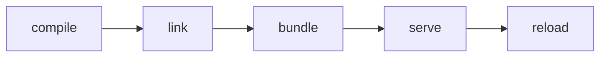
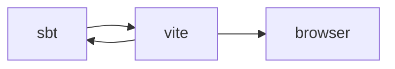
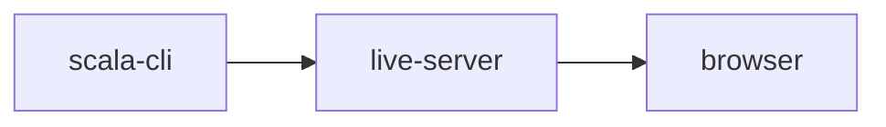

## Why?
The key idea is to take advantage of the fact that:

1. browsers are already able to load JavaScript ES modules from a URL
2. JavaScript CDNs such as unpkg and jsDelivr already serve NPM packages as ES modules from URLs

## Backstory
A couple of years back, Arman and I had a convesation about scala JS imports, and I successfully showed that a horrible `@JSImport("default", "http://@esModule/import/my/library")` could work. Like this however, it had serious shortcomings - notably that obtaining the ESModules was tied to the _compiled_ artifact.

Arman wrote an SBT plugin which interfaced with the linker circumventing this shortcoming. This allowed the a mapping to be specified at link time in SBT... and dealty with the knarly JSLinker interface.
https://github.com/armanbilge/scalajs-importmap

However, I believe the ideal application would be to have it in scala-cli.
https://github.com/VirtusLab/scala-cli/discussions/1968#discussioncomment-5446977

## Status:
Merged! - https://github.com/VirtusLab/scala-cli/pull/2737

Some adjustments to [scala-js-cli](https://github.com/VirtusLab/scala-js-cli/pull/47) were needed, as well as some changes to scala-cli itself.

## Usage Notes
Armans idea ended up being to represent this accordsing to the import map, supported by browsers.
https://developer.mozilla.org/en-US/docs/Web/HTML/Element/script/type/importmap#import_map_json_representation

An example map, could look like this, which would resolve shoelace components.

```json
{
  "imports": {
    "@shoelace-style/shoelace/dist/": "https://cdn.jsdelivr.net/npm/@shoelace-style/shoelace@2.13.1/cdn/"
  }
}
```
And this project, demonstrates that it works, when referencing the ever excellent raquo's shoelace component library. The scalacode that references a button component in the UI library, looks something like.

```scala
  @JSImport("@shoelace-style/shoelace/dist/components/button/button.js", JSImport.Namespace)
  @js.native object RawImport extends js.Object
```
But a consumer for the most part, doesn't need to worry about that... at the use site, once the ESModule is loaded, it's just a matter of using the component as if it were a native scala.js component.

```scala
  val button = Button()
  button.addEventListener("click", _ => println("Hello, world!"))
  document.body.appendChild(button)
```

## Use Cases

Currently, I see three attractive use cases for this.

1. Facade construction
2. Testing
3. "on ramp"

### Use cases: On ramp

This is the attractive one for me. Scala-js toolchain is relatively involved.



When I started, it took some time, to get used to this - needs at least two consoles running. When things go wrong, do I need to look at sbt, vite or what?

We  need all that stuff, but instead of



We can now do


Where the live server is a vscode extension which reloads on change.

I personally, find this model far easier to understand.


### Use cases: Facade construction

This sweeps SBT / vite out the way, and the speed at which one can get started with scala-cli, makes facade construction way more attractive.

### Use cases: Testing

Again,


## Prior Art
https://github.com/explodinggradients/ragas

## Notes
I think there are three key ways we could consider differenting this project.

1. Mills fine grained caching, could allow a constant time feedback loop, even as number of documents and prompts grow.
2. If we write a X platform API, it shoudl be possible to expose diagnostic information to the user via a web api. This could be used to build a UI to help users understand the quality of their prompts.
3. Consider seperation of retrieval via cosine search, and generation.