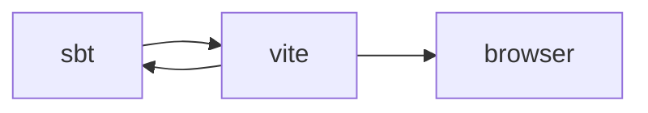
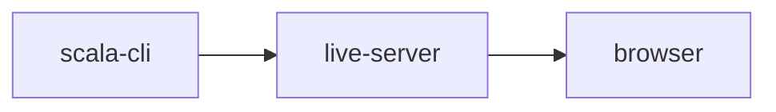

## Why?
The key idea is to take advantage of the fact that:

1. browsers are already able to load JavaScript ES modules from a URL
2. JavaScript CDNs such as unpkg and jsDelivr already serve NPM packages as ES modules from URLs

## Backstory

A couple of years back, Arman and I had a conversation about scala JS imports, out of which came the odd notion, that horrible `@JSImport("http://cdn/esModule/import/my/library", "default")` could work. And proved it with a hardcoded import. Like this however, it had serious shortcomings - notably that obtaining the ESModules was tied to the _library_ artifact.

Arman wrote an SBT plugin which interfaced with the linker circumventing this shortcoming. This allowed mappings to be specified at application link time in SBT... dealt with the knarly JSLinker interface... and "proved the concept".
https://github.com/armanbilge/scalajs-importmap

Thanks :-)...

However, I believe the ideal application would be to have it in scala-cli.
https://github.com/VirtusLab/scala-cli/discussions/1968#discussioncomment-5446977

## Status:
Merged! - https://github.com/VirtusLab/scala-cli/pull/2737

Some adjustments to [scala-js-cli](https://github.com/VirtusLab/scala-js-cli/pull/47) were needed, as well as some changes to scala-cli itself.

## Usage Notes
Armans idea ended up being to represent this accordsing to the import map, supported by browsers.
https://developer.mozilla.org/en-US/docs/Web/HTML/Element/script/type/importmap#import_map_json_representation

An example map, could look like this, which would resolve shoelace components from a CDN, as they are needed

```json
{
  "imports": {
    "@shoelace-style/shoelace/dist/": "https://cdn.jsdelivr.net/npm/@shoelace-style/shoelace@2.13.1/cdn/"
  }
}
```
This example [shoelace playtime]() project, demonstrates that it works, when referencing the ever excellent raquo's shoelace component library. The scalacode that references a button component in the UI library, looks something like.

```scala
  @JSImport("@shoelace-style/shoelace/dist/components/button/button.js", JSImport.Namespace)
  @js.native object RawImport extends js.Object
```
This remaps the import to be
`"https://cdn.jsdelivr.net/npm/@shoelace-style/shoelace@2.13.1/cdn/components/button/button.js"`

but once the remapping is in place... at the application use site it's just a matter of using the component as if it were a native scala.js component.

Our button may then be used as normal.

```scala
  val button = Button()
  button.addEventListener("click", _ => println("Hello, world!"))
  document.body.appendChild(button)
```

Note: Scala JS facade authors could choose (for bonus points)  to publish the required import map in their library documentation.

## Use Cases

Currently, I see three attractive use cases for this.

1. Facade construction
2. Testing
3. "on ramp"

### Use cases: On ramp

This is the attractive one for me. Scala-js toolchain is relatively involved.


When I started, it took some time, to get used to this, what is connceted to what, etc.. When things go wrong, do I need to look at sbt, vite or what? My understanding ended up something like;


As far as I can tell, vite is watching files for when they change. When they change it contacts sbt / mill. This "bi-directional" symbiosis was confusing for me, when I started out. Instead, we can now do


Where the live server is a vscode extension / intellij static site which reloads on change.

I personally, believe this model is easier to understand when getting started. I'm not an eco-system expert - I could have missed something and feedback is welcome - but before mentally flaming this - please read "non-goals".

### Use cases: Facade construction

This sweeps SBT / vite out the way, and the speed at which one can get started with scala-cli, makes, IMHO, facade construction more attractive and easier to swallow in "side projects" to the main application.

Said differently, this allows one to "experiment in the small".

### Use cases: Testing

Because there's no bi-directional communication between vite / sbt, we are reloading linked artefacts into the browser as a static site, with ESModules resolving in browser.

There's no bundling step involved, which mean no process syncronisation, so I think UI becomes "unit testable" via playwrite, rather than "integration testable".

I'm at the beginning of exploring this, but if it works as well as I believe, it will fundamentally change the way I test frontend code.

## Non-goals

It is categorically _not_ a goal to replace the existing vite / sbt infrastructure. This is intended to _compliment_ to it. Any work done via this mechanism, can be trivially re-used, either through a bundler or the SBT plugin.

It is hoped, that a new user of scala-js, may be able to experience the joys of scala on the frontend, faster and more simply during an experimentation phase, before wheeling in the existing, excellent-but-complex toolchain.

## TODO
Mill plugin
